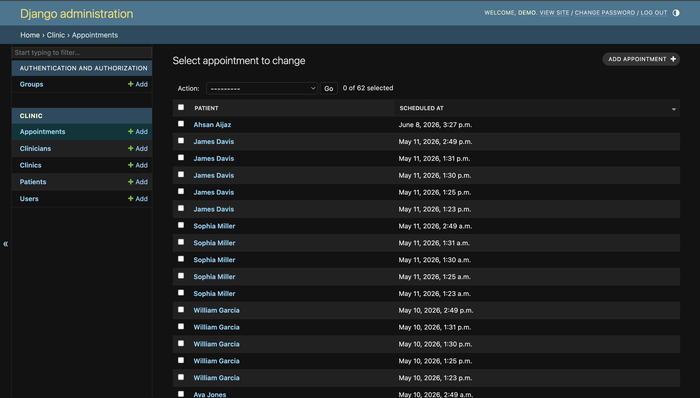
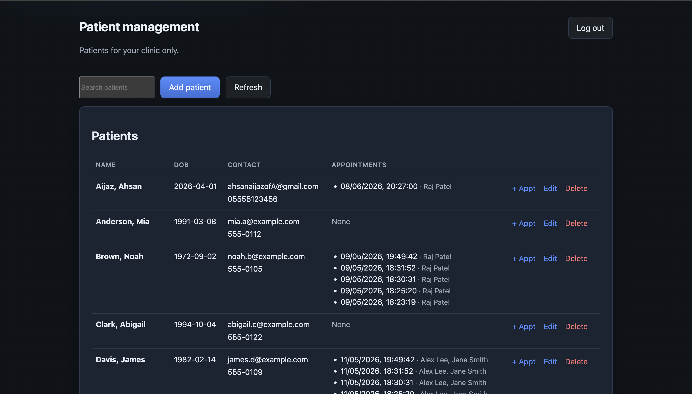
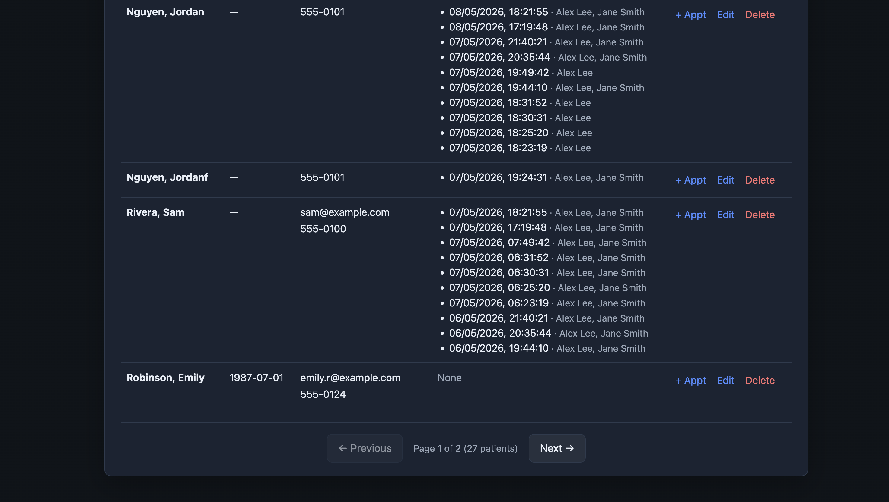
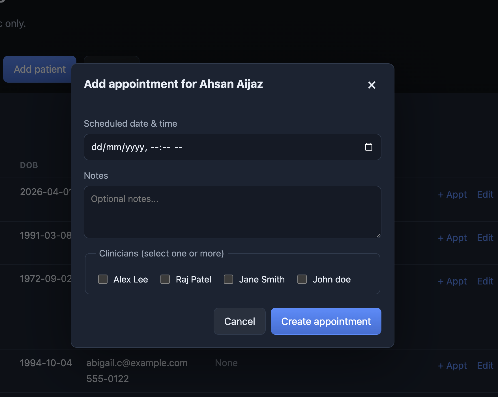
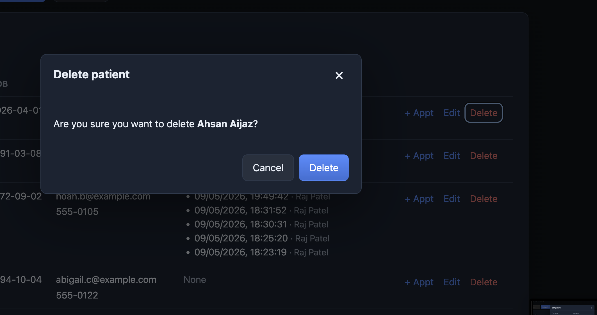
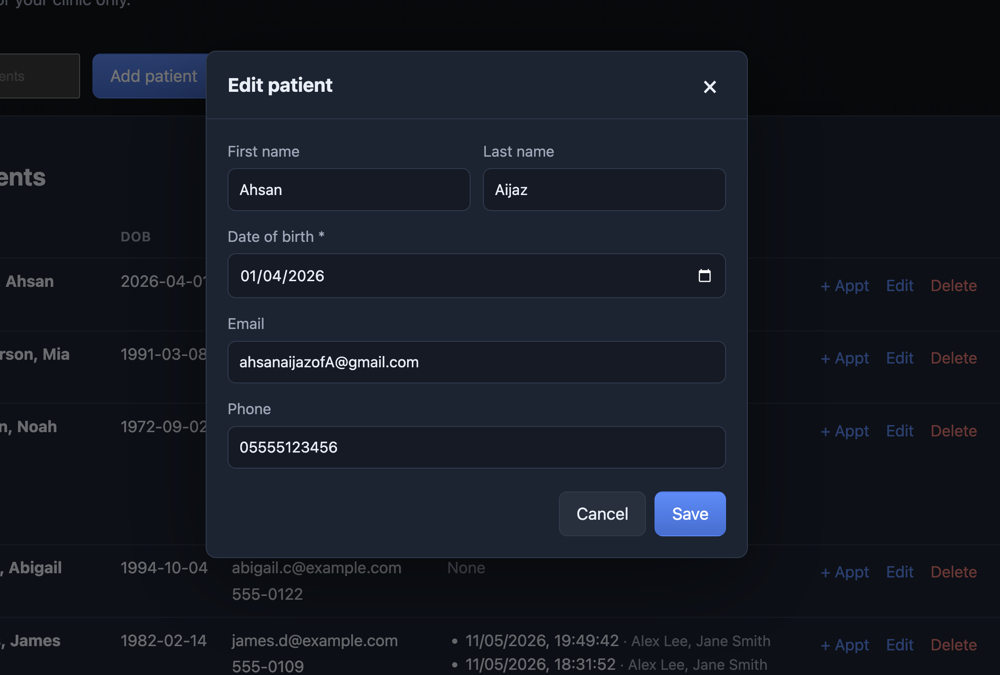
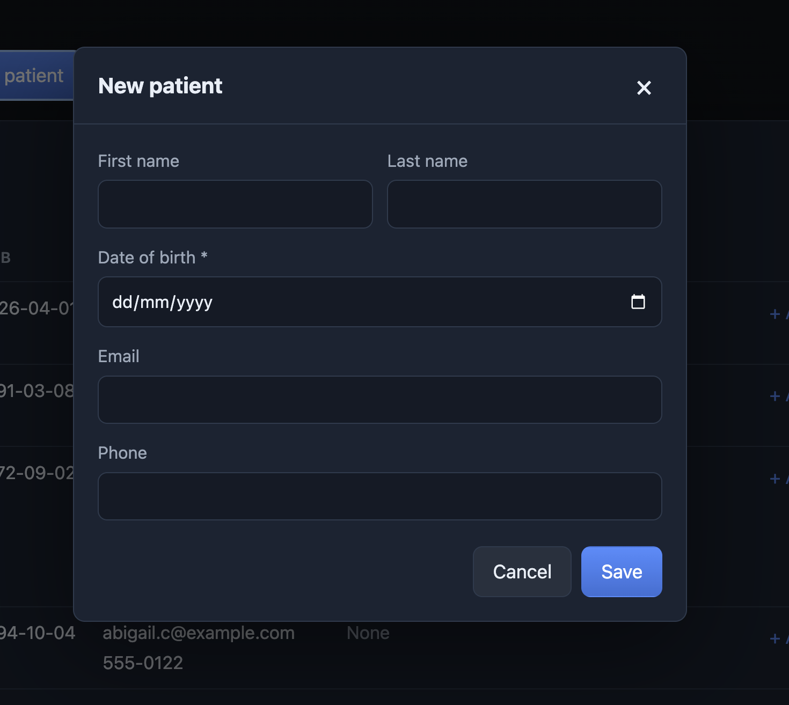

# Patient Management (Django + React)

Full-stack clinic **patient** CRUD: staff sign in, then list, create, update, and delete patients for their own clinic. The backend uses split **models / views / serializers**; the frontend uses **`src/`** (`app/`, `components/` including `components/modals/`, `hooks/`, `store/`, `services/` for RTK Query APIs) with **Redux Toolkit** and **RTK Query**.

## Screenshots

| Login | Patient List |
|:---:|:---:|
|  |  |

| Add Patient | Add Appointment | Delete Patient |
|:---:|:---:|:---:|
|  |  |  |

| Pagination | Django Admin |
|:---:|:---:|
|  |  |

## Run with Docker

```bash
docker compose up --build
```

- **UI:** http://localhost:8080  
- **API:** http://localhost:8000/api/  
- **Health:** http://localhost:8000/api/health/

After startup, `seed_demo` provides user **`demo`** / **`demo1234`**.

`docker compose down` — add `-v` to remove the Postgres volume.

## Local development

### Backend

```bash
cd backend
python -m venv .venv
source .venv/bin/activate
pip install -r requirements.txt
export USE_SQLITE=1
export DJANGO_DEBUG=1
python manage.py migrate
python manage.py seed_demo
python manage.py runserver
```

### Frontend

```bash
cd frontend
npm install
npm run dev
```

Open http://localhost:5173. Leave `VITE_API_URL` unset so `/api` is proxied to the Django server.

## Running Tests

```bash
cd backend
source .venv/bin/activate
USE_SQLITE=1 python manage.py test
```

To run with verbose output:

```bash
USE_SQLITE=1 python manage.py test --verbosity=2
```

62 tests cover models, views, serializers, middleware, management commands, admin, and auth (80-90% coverage).

## API

| Method | Path | Description |
|--------|------|-------------|
| POST | `/api/auth/login/` | JWT (body: `username`, `password`) |
| POST | `/api/auth/token/` | Same as login |
| POST | `/api/auth/token/refresh/` | Refresh |
| GET/POST | `/api/patients/` | List / create (scoped to user’s clinic) |
| GET/PATCH/DELETE | `/api/patients/<id>/` | Detail / update / delete |
| GET/POST | `/api/appointments/` | List / create appointments |
| GET/PATCH/DELETE | `/api/appointments/<id>/` | Detail / update / delete appointment |
| GET | `/api/clinicians/` | List clinicians for user's clinic |

## Layout

| Path | Role |
|------|------|
| `backend/` | Django: `config` (settings/urls), `clinic` app |
| `frontend/` | Vite + React: `src/` (app, components, hooks, store, services) |

## GitHub Actions

Workflow **Docker** uses `workflow_dispatch`, builds images, runs Compose, and checks `/api/health/`.

## Makefile

`make up`, `make down`, `make dev-backend`, `make dev-frontend` — see `Makefile`.
